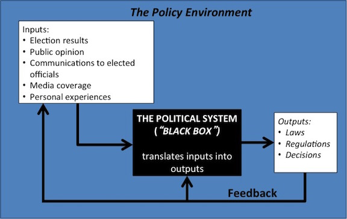
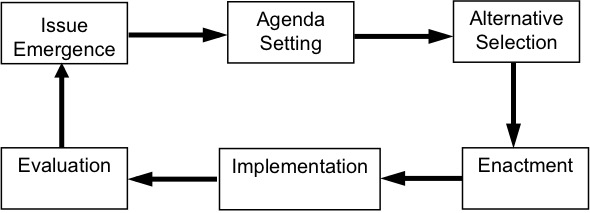
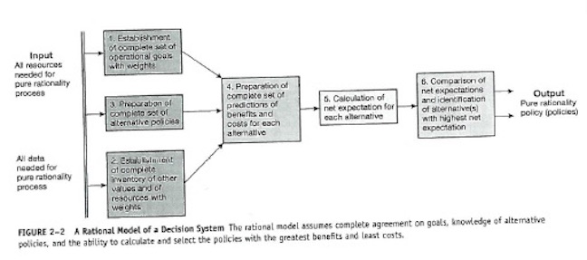
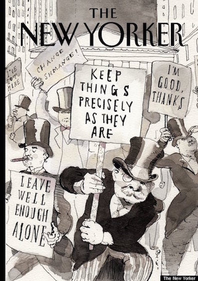

## Public Policy

### Definitions 

---

### Shared Ideas 

* Policy responds to a problem 
* The policy is made in the "public’s" behalf
* Policies have goals 
* Policies are made by governments
* Policies are implemented by public and private actors
* Policy can be action or inaction

---

### Forms of Policy

* Constitutional provisions
* Laws 
* Regulations
* _It is expressed in goals articulated by political leaders; in
  formal statutes, rules, and regulations; and in the practices of
  administrative agencies and courts charged with implementing or
  overseeing programs_ (Kraft and Vig)

---

### Studying Public Policy

* Knowledge _of_ vs. knowledge _in_

* Knowledge of:
    * The policymaking process

* Knowledge in:
    * Used to make policy decisions

---

## Policy Models 

### 

* How is politics defined?
<!-- laswell: who get what, when, and how -->

* What are models?
<!-- simplified version of reality -->

* How are they used?

* Selected policy models:
    * _Systems model_ 
    * Process (stages; cycle) model
    * Institutional model
    * Rational model; rational choice
    * Incremental model
    * Group model; pluralism
    * Elite model
    * Public choice model
    * Game theory model
    
---

### Policymaking System

---

### Policymaking Process

---

### Institutionalism 

* Institutions: _Public policy is authoritatively determined, implemented, and
    enforced by government institutions_
    * Congress, the presidency, courts, bureaucracies
    * Government institutions give public policy three distinctive
    characteristics:
        * Legitimacy: legal obligations; democratic; the Constitution
        * Universality: extends to all citizens 
        * Coercion: imprison violators 

* _Government institutions provide structure to the process of policymaking_ 

---

### Rationalism

* Rational policy achieves maximum social gain

---

### Incrementalism

* Policymaking under constraint
    * Time
    * Information
    * Cost

* Base + or -

* Applied to public budgets

---

### Group Theory

* Individuals with common interests band together
  formally or informally to press their demands on government

* _Pluralism_

* Role of political system:
    * Establish rules
    * Arrange compromises and balance interests
    * Enacting compromise (policy)
    * Enforce compromise

---

### Elite Theory

---

### Public Choice Theory

* Economic study of nonmarket decision making

* _All political actors seek to maximize their personal benefits in politics as well as the market place_

* Collective decision making leads to mutual benefit

* _Social contract_

* Market failures
    * Public goods
    * Externalities

* [Becker-Posner Blog](http://www.becker-posner-blog.com/)

---

### Game Theory

* Study of decisions in situations in which two or more rational participants have choices and the outcome depends on the choices by each

* Examples:
    * Chicken 
    * Prisoner's dilemma
    * _Deterrence_

---

### Next Week

* McCool, Daniel. 1998. ["The Subsystem Family of Concepts: A Critique and a Proposal."](http://www.jstor.org/stable/449091?seq=1#page_scan_tab_contents) _Political Research Quarterly_ 51(2): 551–70.

* Baumgartner, Frank R., and Bryan D. Jones. 1991. ["Agenda Dynamics and Policy Subsystems."](http://www.jstor.org/stable/2131866?seq=1#page_scan_tab_contents) _The Journal of Politics_ 53(4):1044–1074.

* Cairney, Paul. 2011. "Punctuated Equilibrium", __Chapter 9__ in _Understanding Public Policy: Theories and Issues_ Palgrave Macmillan, New York. on [OAKS](https://lms.cofc.edu/)

* Pralle, Sarah B. 2009. ["Agenda-Setting and Climate Change."](http://www.tandfonline.com/doi/abs/10.1080/09644010903157115#.VJjk2sCA) _Environmental Politics_ 18(5): 781–99.
    

